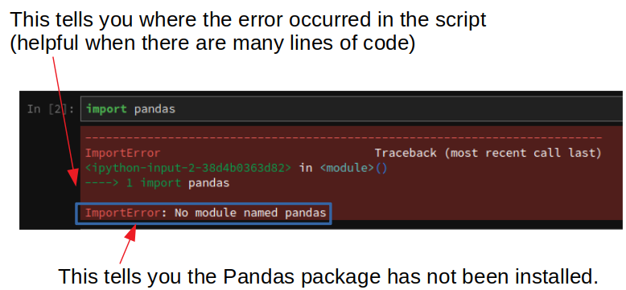
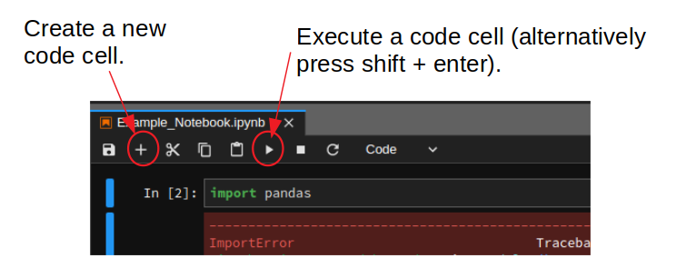
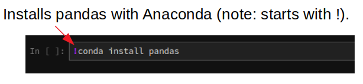

# Foreword

This book consists of a set of interactive notebooks on the topic of applied hydrology, created by [Dan Kovacek](https://civil.ubc.ca/faculty/dan-kovacek/) and [Steven Weijs](https://civil.ubc.ca/faculty/steven-weijs/) at the University of British Columbia.  The notebooks were originally developed as a set of tutorials for courses in engineering hydrology (CIVL 418/551 and IWME 502).  The aim of these notebooks is to introduce students to programmatic data analysis using the open-source *Jupyter Notebook* software, which is a powerful interactive computing platform.

**Students are not expected to have prior experience with programming.**  The emphasis of these notebooks is on hydrological concepts rather than computer science, so all necessary code is provided.  Each notebook focuses on a particular component of hydrological analysis, and students will be asked to answer questions about the underlying concept that may require changing variables and re-running code blocks to update results.  The instructions provided with the code in the notebooks will facilitate the exploration of the concepts from a systems perspective.

>**Note** The content of these notebooks does not represent a prescriptive set of methods for hydrological analysis.  Instead, the intent is to introduce some basic concepts through a series of activities that encourage thinking about model uncertainty and sensitivity.

## Getting Started with Interactive Python Notebooks

The Jupyter notebook exercises in this course can be accessed in the following ways:

* **On your computer**: The package and environment manager [Anaconda](https://www.anaconda.com/) is recommended.  Programming in Python is exciting and accessible because it uses powerful functions written in application-specific libraries.  Anaconda is the software that does its best to make sure everything cooperates and runs smoothly.  After installing Anaconda, you can then install [Jupyter Lab](https://jupyter.org/).  
* **in the cloud**: notebooks can also be run 'in the cloud' using [Binder](https://mybinder.org/) which you can then access in your web browser.  Binder is a great way to share your code with others and to demonstrate your work remotely with full functionality.  It's important to note that files accessed this way **may not be saved** in the cloud instance, and any changes made will have to be saved locally to your computer, or rewritten if you exit and restart the instance.  

>**Note**: Anaconda has recently introduced a paid subscription level, but this is not necessary to run the software.  You don't necessarily need Anaconda, but using it will minimize your setup time installing required packages.  [Miniconda](https://docs.conda.io/projects/conda/en/latest/user-guide/install/windows.html) is a much smaller alternative, but it requires manual installation of packages used in the jupyter notebooks.  This installation process is not difficult however, and it can be accomplished right in the notebook.  i.e. installing the numpy and pandas packages would simply be a matter of running `!conda install numpy pandas` in a code block&mdash;once is enough unless you reinstall miniconda.

### Set up and Preparation

[Detailed installation instructions can be found here.](https://nbviewer.jupyter.org/github/ehmatthes/intro_programming/blob/master/notebooks/programming_environment.ipynb)  Please ensure you have Python installed (version should be Python 3.6 or greater) and you can open Jupyter and run a notebook.

A discussion thread dedicated to installation and setup will be created on Canvas.  If you still have difficulty after reviewing the resources provided here, please post questions (with as much detail as you can provide) to the Canvas discussion forum and the instructor and TA will be available to help.

### Learning Resources

Programming is a different paradigm compared to spreadsheet-based software.  At the start, the number of new concepts can be overwhelming and it is easy (and normal) to feel like this:

  
(source: [Gfycat.com](https://gfycat.com/))

The web is full of excellent learning resources!  An investment in learning some fundamental concepts is well worth your time.  A few resources to get you started are provided below:

* [How to run code in the notebook](https://nbviewer.jupyter.org/github/jupyter/notebook/blob/master/docs/source/examples/Notebook/Running%20Code.ipynb).  Basics of Python syntax and programming in the Jupyter notebook.
* [Matplotlib](http://nbviewer.ipython.org/github/jrjohansson/scientific-python-lectures/blob/master/Lecture-4-Matplotlib.ipynb) is a popular library for creating a wide variety of plots.  
* [Introduction to Python](https://nbviewer.jupyter.org/github/ehmatthes/intro_programming/blob/master/notebooks/index.ipynb).  An introductory course taught through an interactive Python notebook in Jupyter.

### A comprehensive list of interesting, useful, and powerful Jupyter notebook examples can be found [here](https://github.com/jupyter/jupyter/wiki).

## Other Information

### Package Installation

If when running a code cell in Jupyter you encounter the following type of error:

This generally means a package has not been installed.  In this case, the package is `Pandas`, which can be installed by creating a new cell:

Typing the following (you can replace `pandas` with the name of the package you need to install)

And executing the cell (shift + enter), or the 'run' button.

## License

The set of notebooks making up this Jupyter Book is licensed under the [Creative Commons Attribution 4.0 International](https://creativecommons.org/licenses/by/4.0/legalcode).
